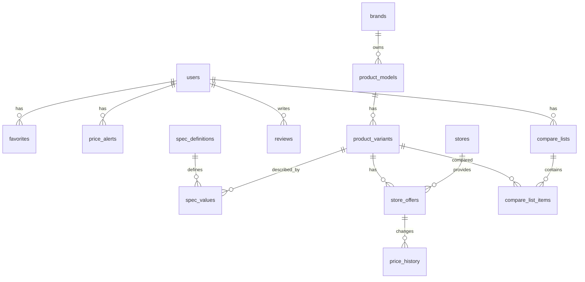
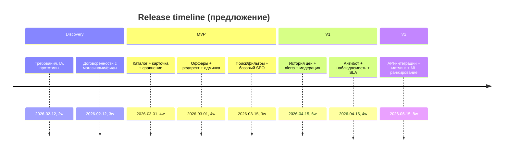
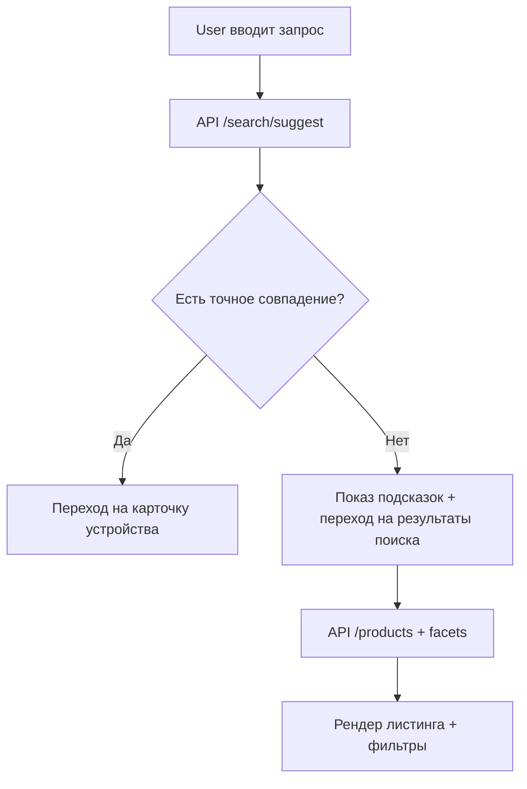
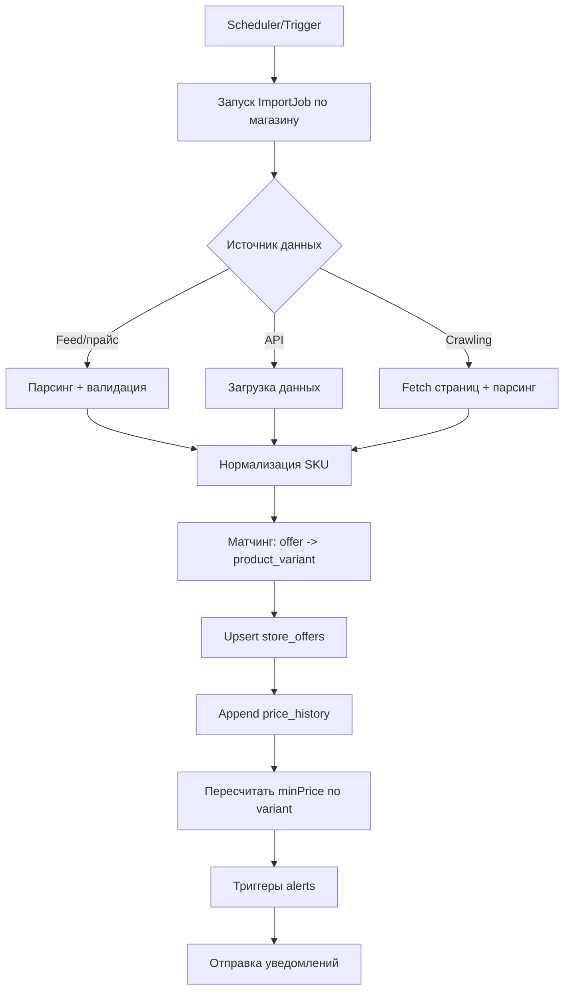

# Создание сайта E-katalog для сравнения телефонов и цен в интернет-магазинах Узбекистана

## Исполнительное резюме

Цель продукта — запустить строгий (минималистичный) агрегатор смартфонов, который объединяет: (а) независимый “справочник устройств” (характеристики, версии/память/цвет, фото), (б) “предложения магазинов” (цены, наличие, условия), (в) инструменты выбора: фильтры, поиск, сравнение, история цен, уведомления о снижении цены и безопасная переадресация в магазин для покупки. Такой формат повторяет ключевую ценность price-comparison паттерна: на странице модели пользователь видит блок «где купить» со списком магазинов, ценами и ссылками на покупку. citeturn13view1

Бенчмарк по функционалу на уровне UX-паттернов (а не копирования реализации): сравнение, подбор по параметрам, текстовый поиск по названию, карточка модели с характеристиками и ценовыми предложениями — базовый стандарт для сервисов класса E‑Katalog. citeturn13view0turn13view1 В зрелых сервисах дополнительно встречаются «следить за ценой» и «график цен» (история), что напрямую усиливает retention и конверсию в переходы/покупки. citeturn2search2turn2search6

По рынку Узбекистана важно учесть, что уже существуют локальные или окололокальные паттерны:
- агрегатор “цены и скидки от всех интернет-магазинов в г. Ташкент” (пример: entity["company","Toptop.uz","price aggregator tashkent"]), где есть разделы для продавцов/партнёров и размещение магазинов; это подтверждает спрос на агрегирование предложений. citeturn7search1  
- сервис подбора товаров и сравнения цен от entity["company","Beeline","telecom operator"] (BeeMarket). citeturn7search5  
- крупные e-commerce игроки/ритейлеры со смартфонами и карточками товаров (например, entity["company","Asaxiy.uz","ecommerce uzbekistan"], entity["company","Texnomart","electronics retailer uzbekistan"], entity["company","Olcha.uz","marketplace uzbekistan"]). citeturn7search16turn7search0turn7search8

Ключевой продуктовый выбор, определяющий всё остальное: разделить доменную модель на два независимых контура данных:
- “Каталог устройств” (Phone/Model/Variant + specs) — единый канонический справочник, не привязанный к конкретным магазинам.
- “Офферы магазинов” (StoreOffer) — динамический слой (цена/наличие/URL/условия), привязанный к варианту устройства, с историей цен и SLA обновления.

Не указано: лимит сравнения (N устройств). Практика рынка даёт рабочие ориентиры: некоторые сервисы ограничивают сравнение 3 устройствами (пример: PhoneArena), другие — 4 устройствами (пример: Kimovil). citeturn1search16turn0search10turn0search2 Рекомендуемое решение для MVP: N=4 (десктоп) и N=3 (мобайл) как дефолт, плюс “расширенный режим” до 6–8 для power users (с горизонтальным скроллом и управлением колонками), но включать расширение только после доказательства спроса (метрики: доля сравнений, ширина таблицы, время до клика в магазин). UX-качество таблиц сравнения критично; для них важны единая структура, сканируемость и простая компоновка. citeturn12search0

Юридический контур (высокий приоритет): закон о персональных данных Узбекистана содержит требование по обработке персональных данных граждан с хранением на технических средствах, физически размещённых на территории страны, и регистрацией базы в госреестре (статья 27¹, действует с 16.04.2021). citeturn9view2 Также действует режим регистрации баз персональных данных и описана заявочная (уведомительная) процедура с использованием инфраструктуры электронного правительства. citeturn10search2turn10search1 В то же время в январе–феврале 2026 публично обсуждались/принимались поправки о смягчении отдельных требований (контекст — особенно актуален, но требует постоянного мониторинга в ходе проекта). citeturn10search3turn10search7turn10search11

Рекомендуемая стратегическая дорожная карта:
- MVP: каталог + карточка устройства + сравнение + поиск/фильтры + офферы/переход в магазин + базовая админка (каталог/магазины/цены) + базовый импорт прайс-листов.
- V1: история цен + «следить за ценой» + уведомления + модерация отзывов + антибот/рейтконтроль + расширенная аналитика.
- V2: интеграции с API/фидами магазинов, полуавтоматический матчинг SKU, ML-ранжирование, персонализация и A/B.

## Референс-исследование рынка и функциональных паттернов

### Что “должно быть” в сервисе класса E‑Katalog

В публичном описании E‑Katalog прямо фиксируются базовые сценарии: подбор по параметрам, сравнение товаров, текстовый поиск, и на странице модели — детальная информация + ссылки/цены магазинов в блоке «где купить». citeturn13view1turn13view0 Это формирует “north star” UX: пользователь не “оформляет заказ” внутри агрегатора, а максимально быстро выбирает и переходит в магазин (или несколько магазинов) с прозрачным пониманием условий. citeturn13view1

Дополнительный retention-паттерн у прайс-агрегаторов: мониторинг цен, «следить за ценой», график/история цен (особенно при частых изменениях). citeturn2search2turn2search6

### Паттерны сравнения и ограничения по N

Рынок показывает, что ограничение “до 3” или “до 4” — распространённый компромисс между удобочитаемостью и полезностью:
- Kimovil: “Choose up to four phones to compare”. citeturn0search10turn0search2  
- PhoneArena: “Compare … up to three devices at once”. citeturn1search16  

Для вашего проекта это означает: дефолт N=4 (desktop) — “попадает в привычку”, а расширение “до 6–8” должно сопровождаться UX-механиками управления таблицей (sticky first column, выбор видимых групп характеристик, сворачивание одинаковых строк, подсветка различий).

### Локальные сигналы по Узбекистану

Наличие агрегаторов и “подбор/сравнение цен” уже заявлено в локальном инфополе:
- Toptop.uz позиционируется как “цены и скидки от всех интернет-магазинов в г. Ташкент”, также указывает витрину магазинов и раздел для продавцов. citeturn7search1  
- BeeMarket описывается как сервис подбора и сравнения цен от Beeline. citeturn7search5  

Плюс значимые магазины/маркетплейсы демонстрируют готовность аудитории покупать смартфоны онлайн, включая рассрочку и широкий ассортимент (Texnomart/Olcha/Asaxiy). citeturn7search0turn7search8turn7search16

## Продуктовая структура и описание страниц

### Общий каркас и системные компоненты

Стандартный каркас для всех публичных страниц (кроме auth/admin) должен быть единым:
- Шапка: логотип (без лишней декоративной графики; favicon допустим), строка поиска, ссылки “Каталог”, “Сравнение”, “Магазины”, “Снижение цены” (если включим), вход/профиль, переключатель языка (RU/UZ; EN — не указано, оставить как future).  
- Навигация: хлебные крошки на всех страницах ниже глубины “каталог”.  
- Футер: “О проекте”, “Контакты”, “Магазинам/Партнёрам”, “Размещение прайс-листов”, “Конфиденциальность/Политики”, “Помощь”. У E‑Katalog есть отдельный пункт “Размещение прайс-листов” в блоке “О проекте”, что подтверждает релевантность механики загрузки прайс-листов как канала интеграции. citeturn13view0turn13view1  

Общие UI-паттерны и состояния:
- Формы: 4 состояния поля (default/focus/error/disabled), подсказки и текст ошибок под полем, маски ввода (телефон, email).  
- Асинхронность: skeleton loading для листингов и карточки, optimistic UI только там, где риск минимален (например, “добавить в сравнение/избранное”).  
- Ошибки: единый компонент ошибок API (таймаут, 429, 5xx), CTA “повторить”.  
- Доступность: клавиатурная навигация и корректные ARIA-паттерны для интерактивных виджетов (модальные окна, комбобоксы, табы). citeturn4search4turn4search1  
- Производительность: страницы должны держать целевые CWV (LCP < 2.5 c, INP < 200 мс, CLS минимальный) как инженерный KPI. citeturn4search2  

Локализация (по умолчанию): RU и UZ. Не указано: “англ”. Предложение: EN включать только для SEO/экспатов после продуктовой стабилизации (V2).

### Список необходимых страниц

Ниже — полный перечень страниц/разделов, сгруппированный по контурам.

Публичные:
- Главная
- Каталог смартфонов (листинг)
- Страница устройства (карточка модели/варианта)
- Сравнение
- Поиск (результаты + автокомплит)
- Бренды: список брендов, страница бренда
- Магазины: список магазинов, карточка магазина
- “Снижение цены” (лента скидок/истории цен) — опционально
- Статьи/гайды/обзоры/глоссарий — опционально (если делаем SEO-контент)
- Помощь/FAQ
- О проекте, Контакты
- Партнёрам/Магазинам: как подключиться, требования к прайс-листам/фиду, правила
- Юридические: условия использования, политика конфиденциальности, cookies, политика обработки персональных данных, отказ от ответственности
- Системные: 404/500, maintenance, robots.txt, sitemap.xml

Пользовательский контур:
- Регистрация/Вход
- Подтверждение email/телефона (если включаем)
- Сброс пароля
- Профиль/настройки
- Избранное
- Уведомления о цене (подписки)
- Списки сравнения (сохранённые)
- “Корзина/список покупок” + переадресация в магазины (по сути basket-of-links)

Админ-панель:
- Вход в админку
- Dashboard (KPIs: офферы, ошибки импорта, покрытие, свежесть цен)
- Управление каталогом устройств
- Управление магазинами
- Управление офферами/ценами/наличием
- Импорт/парсинг прайс-листов и интеграции (jobs)
- Матчинг (ручной) “оффер → устройство”
- Отзывы/рейтинги: модерация
- Пользователи и роли
- Отчёты и аудит
- Настройки системы (кэш, фичефлаги, интеграции, лимиты)

Раздел разработчика/интеграций:
- Документация публичного API
- Документация партнёрского API/форматов прайс-листов (CSV/XML/JSON)
- Webhooks (если есть)
- Статус интеграций/health

---

Далее — спецификация структуры и поведения для ключевых страниц. Чтобы отчёт был пригоден для передачи команде, формат унифицирован: назначение → блоки → UI/поведение → данные → SEO → доступность → локализация.

### Главная

Назначение: “быстрый вход” в сценарии выбора (поиск, популярные модели, бренды, скидки/ценовые падения).

Блоки:
- Header (общий).
- Hero без визуального шума: заголовок/подзаголовок, большая строка поиска (с автокомплитом).
- Быстрые входы: “Сравнить”, “Подбор по параметрам”, “Популярные бренды”.
- Популярное сейчас: топ устройств по просмотрам/переходам (если есть данные), либо “новинки” (осторожно: не всегда достоверно).
- Блок “магазины-партнёры” (логотипы в монохроме) — опционально.
- Footer (общий).

UI/поведение:
- Поиск: автокомплит по названиям моделей/брендов + подсказки категорий. Для e-commerce автокомплит должен быть быстрее обычного поиска, иначе деградирует UX. citeturn11search2turn11search6  
- Переход по Enter ведёт на /search?q=… или сразу на карточку устройства при точном совпадении.
- Ошибка “нет результатов” — предлагать популярные запросы/бренды.

Данные:
- /api/search/suggest
- /api/home/sections (топы/бренды/магазины)

SEO:
- Title: “Сравнение цен на смартфоны в Узбекистане — …”
- Meta description: ценность (сравнить цены в магазинах, фильтры, уведомления)
- Разметка: Organization/WebSite + SearchAction (опционально), плюс hreflang RU/UZ.
- Canonical: на саму главную.

Доступность:
- Фокус-стили видимы.
- Автокомплит — по ARIA combobox pattern. citeturn4search4turn4search1  

Локализация:
- RU/UZ: тексты интерфейса; формат валюты UZS; единицы (ГБ, мАч) одинаковы, но подписи переводятся.

### Каталог смартфонов

Назначение: качественный “подбор по параметрам” + сортировки + быстрый add-to-compare.

Блоки:
- Header + breadcrumbs.
- Панель фильтров (лево на десктопе / bottom-sheet или drawer на мобайле).
- Панель сортировки и “активных фильтров” (chips).
- Результаты (карточки устройств).
- Пагинация или бесконечный скролл (рекомендация: пагинация для SEO и стабильности).

Фильтры (минимальный must-have для смартфонов):
- Цена (диапазон, “до”, “от”, а также “по магазинам” — опционально).
- Бренд.
- Экран: диагональ, тип матрицы, частота.
- Память: RAM, storage.
- Процессор/производительность (уровни).
- Камера: основной модуль (МП — как прокси, но осторожно), наличие OIS.
- Аккумулятор: мАч, быстрая зарядка.
- Связь: 5G, NFC, eSIM.
- Прочее: защита IP, 3.5mm, слоты SIM.

Сортировки:
- По популярности (внутренняя метрика).
- По минимальной цене (по агрегированным офферам).
- По новизне (только если корректно ведём дату релиза).
- По рейтингу (если включаем отзывы/оценки).

UI/поведение:
- Изменение фильтров не перезагружает страницу полностью; URL обновляется query-параметрами (для shareability).
- Валидация диапазонов: min ≤ max; некорректные значения подсвечивать и превращать в безопасные.
- Пустой результат: показать “снимите фильтры” + предложить близкие варианты (relax).
- Кнопки: “Добавить в сравнение” (incremental), “В избранное” (если user).

Данные:
- /api/products?filters…&sort=…&page=…
- /api/filters/facets (агрегации)
- /api/products/{id}/min-price (можно батчем)

SEO:
- Для листингов и фильтров риск дублей. Нужны canonical и стратегия индексирования комбинаций.
- Для Яндекса релевантна работа с canonical (поддержка rel="canonical" описана), но canonical не гарантирует попадание в поиск для всех вариантов — требуется дисциплина. citeturn12search3turn12search12  
- Для Google: контролировать индексацию через robots meta tag на уровне страницы при необходимости (noindex для “мусорных” комбинаций). citeturn3search5turn3search1  

Доступность:
- Фильтры должны работать с клавиатуры, drawer — управляться по ESC/Tab.
- Чекбоксы/радио/ползунки — с корректными label.

Локализация:
- Значения фильтров переводятся, но числовые значения и единицы единообразны.
- Транслитерация в URL — опционально; безопаснее хранить slug на RU/UZ.

### Страница устройства

Назначение: единая точка принятия решения: спецификации + сравнение + лучшие предложения + доверие.

Ориентир UX: на странице модели должна быть подробная информация и блок “Где купить?” со списком интернет-магазинов, ценами и прямыми ссылками на покупку. citeturn13view1

Блоки:
- Header + breadcrumbs.
- Title: “Бренд Модель (память/цвет)” + короткое резюме (ключевые 3–5 фич).
- Медиа: фото (минимум 3), без тяжёлых галерей на первом экране.
- Быстрые действия: “В сравнение”, “Следить за ценой”, “Поделиться”.
- Блок “Цены”:
  - Минимальная/средняя цена (если считаем).
  - Таблица офферов магазинов: магазин, цена, наличие, доставка/самовывоз (если есть), гарантия (если есть), кнопка “Перейти в магазин”.
- Характеристики: секции (Экран, Производительность, Камеры, Память, Связь, Корпус).
- Отзывы и рейтинг (если включаем).
- Похожие модели / “часто сравнивают”.

UI/поведение:
- Офферы:
  - “Перейти в магазин” — всегда открывает “редирект-страницу” вашего домена (для трекинга/антифрода/дисклеймера), затем 302/307 на магазин.
  - Проверка URL оффера (whitelist доменов магазина).
  - Сортировка офферов: по цене (default), затем по наличию.
- “Следить за ценой”:
  - Для гостя: предложить email/telegram (по выбору) либо “вход/регистрация”.
  - Для пользователя: создать подписку (threshold: абсолютная цена или %).
- “Сравнить”:
  - Добавление в compare-list; если список переполнен (N достигнут), показать модал: заменить/расширить.
- Состояния:
  - Если офферов нет: показать “нет предложений” + кнопка “уведомить, когда появится” (опционально).
  - Если данные устаревшие: бейдж “обновлено X часов назад”.

Данные:
- /api/products/{productId}
- /api/products/{productId}/offers
- /api/products/{productId}/price-history (если включаем)
- /api/products/{productId}/reviews (если включаем)
- /api/compare/add
- /api/alerts (create/update)

SEO:
- Title: “Купить {модель} — сравнение цен в магазинах Узбекистана”
- Description: “характеристики + где дешевле + уведомления о цене”
- Canonical: на канонический URL варианта.
- Structured data: Product + AggregateOffer (для нескольких продавцов) — это прямо описано в документации Google как релевантный тип для сравнения нескольких предложений продавцов. citeturn3search0turn3search12  
- Для Яндекса: использовать schema.org свойства “товары/цены” согласно поддерживаемым схемам. citeturn3search2turn3search34  

Доступность:
- Галерея фото — доступна с клавиатуры.
- Таблица офферов: правильные заголовки столбцов, сортировка доступна.

Локализация:
- Валюта и формат чисел единый (UZS).
- Перевод характеристик: держать словарь терминов (например, “встроенная память”, “частота обновления”).

### Сравнение

Назначение: “decision cockpit”: сравнить 3–4 (или больше) устройств по важным группам характеристик и цене.

Блоки:
- Header + breadcrumbs.
- Полоса добавления: поле поиска “добавить устройство”, отображение выбранных устройств (cards).
- Управление таблицей:
  - “Показывать только различия”
  - Выбор групп характеристик (чеклист)
  - Сортировка колонок/перетаскивание (опционально)
  - “Сохранить список” (для пользователя)
- Таблица сравнения:
  - Первая фиксированная колонка: названия характеристик.
  - Колонки устройств: значения.
  - Вверху каждой колонки: мини-карта устройства + минимальная цена + CTA “где купить”.

 UX-качество: сравнение работает лучше при консистентной структуре, сканируемости и простой компоновке. citeturn12search0

UI/поведение:
- Лимит N: не указано. Варианты:
  - Стандарт: N=4 (desktop) / N=3 (mobile) — соответствует распространённой практике. citeturn0search10turn1search16  
  - Power: N=6–8 (desktop) с горизонтальным скроллом.
- Если пользователь пытается добавить устройство сверх лимита: модал “удалите одно / включите расширенный режим”.
- “Показывать различия”:
  - Строки с идентичными значениями скрываются.
- “Сохранить список”:
  - Попросить название списка; валидация: 1–60 символов; уникальность в рамках пользователя.

Данные:
- /api/compare (get current list, by user or by session token)
- /api/compare/items (add/remove/reorder)
- /api/products/batch (для загрузки сравниваемых)
- /api/offers/batch-min-price

SEO:
- Публичные сравнения можно индексировать только если есть стойкие URL вида /compare/{shareId}. Иначе noindex.
- Если делаем share-ссылки: canonical на /compare/{id}, robots meta управлять индексированием. citeturn3search5turn3search1  

Доступность:
- Таблица: управление фокусом, sticky headers, aria-describedby, понятные заголовки.
- Переключатели/чеклисты: корректные label.

Локализация:
- Тексты и названия групп характеристик на RU/UZ.

### Поиск

Назначение: найти модель по названию, а также поддержать “исследовательский” поиск с подсказками.

Блоки:
- Header, поле поиска (уже заполнено), результаты.
- “Подсказки” (если 0 результатов): бренды, популярные модели, более общий запрос.
- Фильтры (облегчённо) прямо на странице поиска.

UI/поведение:
- Автокомплит (search-as-you-type):
  - подсказки по моделям, брендам;
  - подсказки по категориям (например, “Samsung, все модели”).
  Подходы к автокомплиту в Elasticsearch (search-as-you-type, completion suggester и др.) описаны как отдельные стратегии. citeturn11search2  
- Опечатки: tolerance 1–2, “did you mean” (V1/V2).

Данные:
- /api/search?q=…
- /api/search/suggest?q=…

SEO:
- /search по умолчанию noindex (чтобы не плодить тонкие страницы).
- “Страницы бренда/категории” — индексируемые.

Доступность:
- Список подсказок — корректные роли, управление стрелками, Enter.

Локализация:
- Синонимы RU/UZ (например, “айфон/iphone”; “самсунг/samsung”).

### Профиль пользователя

Назначение: управление подписками и списками, минимальная персонализация.

Блоки:
- Профиль: имя/почта/телефон (не обязательно всё), язык, часовой пояс (если нужен).
- Избранное: устройства.
- Подписки на снижение цены (alerts).
- Сохранённые сравнения.
- Настройки приватности и уведомлений.

UI/поведение:
- Валидации:
  - email — RFC-совместимо;
  - телефон — маска +998… (если телефон обязателен — не указано; лучше сделать опциональным).
- Удаление аккаунта: двухшаговое подтверждение.
- Экспорт данных пользователя (опционально, V2).

Данные:
- /api/me
- /api/me/favorites
- /api/me/alerts
- /api/me/compare-lists

SEO:
- noindex.

Доступность:
- Формы и табы (если есть) — по ARIA patterns. citeturn4search4turn4search1  

Локализация:
- Все тексты RU/UZ.

### Корзина/покупка/переадресация в магазины

Критическое уточнение доменной модели: агрегатор цен обычно не проводит “checkout” внутри себя; он ведёт пользователя в магазин. Это подтверждается паттерном “где купить” + прямые ссылки на покупку. citeturn13view1

Рекомендуемый компромисс под ваше требование “корзина/покупка”:
- “Корзина” = список выбранных устройств/вариантов с выбранными магазинами (basket-of-links), чтобы пользователь мог “собрать” покупку, но фактически уйти в магазины отдельными переходами.
- Переадресация через /out/{offerId}?utm=… для трекинга и защиты.

Блоки корзины:
- Список товаров:
  - устройство (вариант) + выбранный магазин (dropdown “где дешевле/где есть”)
  - цена и наличие
  - кнопка “Перейти в магазин”
- “Итого”: сумма (условная, т.к. разные магазины), дисклеймер “оформление и оплата на стороне магазина”.
- Опции: “открыть все ссылки”, “экспорт в PDF/печать” (опционально).

UI/поведение:
- Если оффер “протух”: предупреждение, предложить “обновить предложения”.
- При клике “Перейти”:
  - логируем click_event;
  - показываем interstitial на 0.5–1.5 сек (опционально) для юридического текста;
  - редиректим.

Данные:
- /api/cart (by user/session)
- /api/cart/items
- /api/out/{offerId} (server-side redirect)

SEO:
- noindex.

Доступность:
- Табличный список с действиями доступен с клавиатуры.

Локализация:
- RU/UZ, валюты.

### Магазины

Назначение: каталог магазинов-партнёров, доверие и условия.

Блоки списка магазинов:
- Поиск по названию магазина.
- Фильтры: город/доставка/рассрочка (если данные есть).
- Карточки: логотип (без цвета или моно), рейтинг магазина (если вводим), кол-во офферов, кнопка “открыть”.

Карточка магазина:
- Описание, контакты, регионы доставки, условия гарантии (если предоставлено), политика возврата (если предоставлено).
- Список актуальных офферов магазина (по смартфонам) + фильтры.
- Индикатор свежести обновления цен.

Данные:
- /api/stores
- /api/stores/{storeId}
- /api/stores/{storeId}/offers

SEO:
- Индексируемые страницы магазинов (если есть уникальный контент).
- Canonical, hreflang RU/UZ.

Доступность:
- Стандартные требования.

Локализация:
- RU/UZ.

### Помощь, О проекте, Контакты

Назначение: легитимность, поддержка, снижение нагрузки на саппорт.

Страницы помощи:
- FAQ по сервису: откуда цены, как часто обновляются, что значит “нет в наличии”, как работает “следить за ценой”.
- Для магазинов: требования к фидам/прайсам, процесс подключения, SLA.

У E‑Katalog в навигации присутствует “Магазинам” и отдельный пункт “Размещение прайс-листов”, что логично повторить как публичный раздел для партнёров. citeturn13view0turn13view1

### Юридические/политики

Минимальный набор:
- Пользовательское соглашение/условия использования.
- Политика конфиденциальности.
- Политика cookies (если есть аналитические cookie).
- Политика обработки персональных данных.
- Отказ от ответственности: “цены могут меняться”, “оформление на стороне магазина”, “мы не являемся продавцом”.

С учётом законодательства Узбекистана:
- Если вы обрабатываете персональные данные граждан, статья 27¹ требует обеспечить сбор/систематизацию/хранение в базах персональных данных на технических средствах, физически размещённых на территории страны, и зарегистрированных в установленном порядке в госреестре. citeturn9view2  
- Процедура регистрации баз описывается как заявочная (уведомительная), с использованием гос.инфраструктуры. citeturn10search2turn10search1  
- Поскольку в 2026 обсуждались поправки о смягчении отдельных требований, комплаенс-часть нужно вести как живой backlog с регулярной проверкой. citeturn10search3turn10search7turn10search11  

### Админ-панель

Назначение: управлять качеством каталога и коммерческой актуальностью (цены/офферы), обеспечивать операционную устойчивость.

Страницы админки:
- Admin login.
- Dashboard: свежесть прайсов, % офферов с ошибками, топ магазинов по ошибкам, очереди задач.
- Каталог устройств:
  - Бренды, модели, варианты (память/цвет/региональная версия).
  - Характеристики: редактор, источники, версионность.
  - Медиа: фото, контроль размеров.
- Магазины:
  - Карточка магазина, домены, правила парсинга/фида, расписание обновлений.
- Офферы:
  - Таблица офферов, фильтры, ручная корректировка, история.
- Импорт и парсинг:
  - Jobs, статусы, логи, повторный запуск, алерты.
- Матчинг:
  - “непривязанные” офферы, инструменты сопоставления.
- Отзывы:
  - очередь модерации, причины отклонения (спам/оскорбления/фейк).
- Пользователи/роли.
- Настройки:
  - Rate limits, API keys, интеграции, feature flags.

UI/поведение:
- Таблицы админки должны поддерживать сортировку, пагинацию, batch-actions — это стандартный паттерн data tables. citeturn12search1turn12search14  

SEO:
- noindex.

Доступность:
- Внутренние интерфейсы тоже должны быть клавиатурно-доступны (особенно таблицы и модалки). citeturn4search4turn4search1  

## Функциональные требования и бизнес-логика

### Поиск, фильтры, сортировки

Функциональные требования:
- Полнотекстовый поиск по моделям/брендам/кодам.
- Автокомплит (search-as-you-type) с низкой задержкой; разные стратегии автокомплита в Elasticsearch описываются как отдельные подходы (search-as-you-type, completion suggester и др.). citeturn11search2  
- Фасеты (агрегации) для фильтров.
- Синонимы RU/UZ, tolerant к опечаткам (V1).
- Сортировки, указанные выше.

Логика ранжирования (предложение):
- Основной сигнал: match по запросу.
- Затем: популярность (views, compare-adds, out-clicks), свежесть модели, наличие офферов, минимальная цена.

### Сравнение

Функциональные требования:
- Добавление из каталога и из карточки.
- Управление колонками, “только различия”.
- Сохранение списков (для пользователя), share-link (опционально).
- Рендер таблицы без “визуального шума”, с акцентом на различия (подсветка). Важность “простого” и сканируемого сравнения подтверждается исследованиями по UX таблиц сравнения. citeturn12search0

### Агрегирование цен из магазинов

Модель данных “цена”:
- Цена оффера = текущая цена + атрибуты (валюта, наличие, доставка, гарантия, рассрочка, состояние товара).
- Один оффер всегда привязан к (store_id, variant_id).

Каналы получения цен (приоритеты, от более легального и стабильного к менее):
- Официальные API — если магазин предоставляет (редко для B2C каталога, чаще для партнёров).
- Прайс-листы/фиды (CSV/XML/JSON), загружаемые магазином в партнёрском кабинете. Релевантность механики подтверждается наличием у E‑Katalog пункта “Размещение прайс-листов”. citeturn13view0turn13view1  
- Кроулинг/парсинг публичных страниц магазина (fallback) — только при ясных правилах и техническом контроле нагрузки.

Обновление цен:
- Не указано: SLA обновления. Разумные варианты:
  - Standard: каждые 6–12 часов для крупных магазинов, 12–24 часа для остальных.
  - Near-real-time для топ-100 моделей: каждые 15–60 минут (через приоритетную очередь).
- Индикатор “обновлено X часов назад” на карточке устройства и магазина.

История цен:
- Сохранять time-series по каждому офферу (price_history), агрегировать на “минимальную цену по моделям”.
- В UI: график “минимальная цена по рынку” и/или “цена в конкретном магазине” (V1).

### Уведомления о снижении цены

Триггеры:
- Цена упала ниже порога (absolute).
- Цена упала на X% за Y дней.
- Появился оффер “в наличии” после отсутствия.

Каналы:
- Email (MVP/V1).
- Web push (V1).
- Telegram-бот (V1/V2), особенно релевантно локальному рынку (как канал, но требует отдельной легализации/политики).

Сценарий подписки:
- Из карточки модели: “Следить за ценой” → выбор порога → подтверждение.

### Рейтинги и отзывы, модерация

Функционально:
- Отзывы о модели устройства (не о магазине) — чтобы избежать юридической путаницы.
- Рейтинг устройства (1–5) и параметры отзыва (плюсы/минусы/комментарий).
- Модерация: очередь, причины отклонения, антиспам.
- В карточке устройства: вкладка “Отзывы”.

Бенчмарк: E‑Katalog указывает наличие отзывов/рейтинга как часть контента каталога. citeturn13view0turn13view1

### Импорт/парсинг прайс-листов, интеграции

Партнёрский кабинет магазина (минимум):
- загрузка файла (CSV/XLSX/XML/JSON) с предпросмотром;
- проверка схемы и ошибок;
- маппинг колонок (название, SKU, цена, наличие, URL, гарантия, доставка);
- расписание обновлений;
- webhooks “импорт завершён”.

Интеграции с API магазинов (если есть):
- Важно различать “seller API” и “catalog API”. Например, entity["company","Uzum Market","marketplace uzbekistan"] публикует seller OpenAPI (упоминаются схемы DBS/FBS и операции по заказам/остаткам), но это не обязательно означает наличие публичного каталожного API для сравнения цен. citeturn7search3turn7search11turn7search7  
- Для монетизации/платежей (если будет подписка “премиум без рекламы”): у entity["company","Uzum Bank","bank uzbekistan"] есть Merchant API с вебхуками. citeturn7search19turn5search20  

### Кэширование, защита от ботов, аналитика, логирование

Кэширование:
- CDN для статики, edge caching для публичных страниц.
- Server-side cache для “топов” и “min price”.

Защита от ботов и злоупотребления:
- Rate limiting на публичные API и /out редиректы.
- Bot management/anti-scraping: использовать решения уровня entity["company","Cloudflare","web security company"] (Bot Management/Rate Limiting) как управляемый слой. citeturn11search0turn11search4turn11search17  
- CAPTCHA как крайняя мера; reCAPTCHA v3 работает через скоринг и может применяться точечно (формы, логин, подозрительные действия). citeturn11search1turn11search22  

Аналитика:
- События: search, filter_apply, compare_add, alert_create, out_click, store_click.
- Дашборды: conversion to out-click, coverage (сколько моделей имеют офферы), freshness SLA.

Логирование:
- Audit log для действий админов.
- Технический log: ingestion jobs, parsing errors, timeouts.

Резервное копирование:
- PITR/архивация WAL и базовые бэкапы — стандартная практика для production PostgreSQL; механика описана в документации (continuous archiving и point-in-time recovery). citeturn11search3turn11search16  

## Нефункциональные требования и комплаенс

### Производительность и масштабируемость

SLO (предложение для публичного фронта):
- LCP < 2.5 сек, INP < 200 мс, CLS в “зелёной зоне” как продуктовый KPI скорости. citeturn4search2  

Нагрузочные ориентиры (не указано, предложить варианты):
- MVP: 50–200 RPS на чтение (каталог/карточка), 5–20 RPS на запись (сравнение/избранное/alerts).
- V1/V2: рост в 5–10 раз, плюс всплески при распродажах.

Масштабирование:
- Разделить чтение (public API) и запись/админку.
- Фоновые воркеры для ingestion/price updates.
- Поиск — отдельный search backend.

### Безопасность

Базовая модель угроз:
- Credential stuffing, XSS, SQLi, IDOR, массовый скрейпинг, подмена affiliate links.

Ориентир по стандартам: entity["organization","OWASP","web app security foundation"] Top 10 — как “контрольный список” рисков веб-приложений. citeturn3search3turn3search19turn3search7  

Требования:
- Auth: bcrypt/argon2, MFA для админки (V1).
- RBAC в админке (контент-менеджер, модератор, оператор, админ).
- Токены: короткоживущие access + refresh.
- Secrets: vault/переменные окружения.
- Rate limiting для логина и публичного API. citeturn11search4turn11search17  

### Доступность

Стратегия: WCAG 2.2 как целевой стандарт (уровень не указан; рекомендовать AA). В русскоязычном контуре есть официальные/справочные страницы, указывающие на WCAG 2.2 как на рекомендацию W3C и на набор принципов доступности WAI. citeturn4search21turn4search33turn4search1  

Практика:
- Контраст, фокус-стили.
- ARIA patterns для автокомплита, модалок, табов. citeturn4search4turn4search1  

### Законодательство и персональные данные

Узбекистан:
- Требование локального хранения и регистрации базы персональных данных для обработки данных граждан с использованием IT/интернета — закреплено в статье 27¹ закона “О персональных данных”. citeturn9view2  
- Регистрация базы персональных данных описана как уведомительная процедура, с использованием гос.системы идентификации. citeturn10search2turn10search1  
- В 2026 обсуждались и одобрялись поправки, меняющие режим отдельных ограничений; это требует отдельного юридического трекинга и обновления политик. citeturn10search3turn10search7turn10search11  

GDPR:
- Не указано, применимо ли (зависит от географии пользователей/бизнеса). Если планируется аудитория ЕС — добавить GDPR-режим (consent, DPA, экспорт/удаление данных) в V2.

## Модель данных и API

### Детальная структура БД

Ниже — целевая модель (PostgreSQL), оптимизированная под: (1) канонический каталог устройств, (2) офферы, (3) историю цен, (4) сравнение/избранное/уведомления, (5) админские процессы.

Таблица: Сущности БД (основные)
Сущность | Назначение | Ключевые поля | Связи
User | аккаунт пользователя | id, email, phone, password_hash, status, created_at | 1–N Favorites, Alerts, CompareLists
Brand | бренд устройства | id, name, slug | 1–N ProductModel
ProductModel | модель (линейка) | id, brand_id, name, model_year, slug | 1–N ProductVariant
ProductVariant | вариант (память/цвет/регион) | id, model_id, ram_mb, storage_mb, color, region, ean | 1–N Offers, 1–N Specs
SpecDefinition | справочник характеристик | id, code, name_ru, name_uz, unit | 1–N SpecValue
SpecValue | значение характеристики | id, variant_id, spec_def_id, value_num/value_text | N–1 ProductVariant
Store | магазин | id, name, legal_name, domains, status | 1–N Offers, 1–N ImportJobs
StoreOffer | оффер магазина | id, store_id, variant_id, price, currency, stock_status, url, updated_at | 1–N PriceHistory
PriceHistory | история цены | id, offer_id, ts, price | N–1 StoreOffer
Favorite | избранное | user_id, variant_id, created_at | N–1 User, N–1 Variant
PriceAlert | подписка на снижение цены | id, user_id, variant_id, threshold_price/percent, channel | N–1 User, N–1 Variant
CompareList | сохранённый список сравнения | id, user_id, name, share_id | 1–N CompareListItem
CompareListItem | элементы сравнения | compare_list_id, variant_id, position | N–1 CompareList
Review | отзыв о модели/варианте | id, user_id, variant_id, rating, text, status | модерация
ImportJob | задача импорта прайса | id, store_id, type, status, started_at, finished_at | логи/ошибки
AuditLog | аудит действий | id, actor_id, action, object_type, object_id, ts | безопасность/форензика

Индексы (минимальный набор, предложение):
- StoreOffer(store_id, variant_id) UNIQUE
- StoreOffer(variant_id, price) для “самая низкая цена”
- PriceHistory(offer_id, ts DESC)
- ProductModel(brand_id, slug) UNIQUE
- ProductVariant(model_id, ram_mb, storage_mb, color, region) UNIQUE
- Full-text: отдельный индекс (либо pg_trgm, либо внешний поиск)

### SQL-схемы (DDL, сокращённый но пригодный старт)

```sql
-- Users
create table users (
  id bigserial primary key,
  email text unique,
  phone text unique,
  password_hash text not null,
  status text not null default 'active',
  locale text not null default 'ru',
  created_at timestamptz not null default now()
);

-- Brands
create table brands (
  id bigserial primary key,
  name text not null,
  slug text not null unique
);

-- Product models
create table product_models (
  id bigserial primary key,
  brand_id bigint not null references brands(id),
  name text not null,
  model_year int,
  slug text not null,
  unique (brand_id, slug)
);

-- Variants (phone SKU)
create table product_variants (
  id bigserial primary key,
  model_id bigint not null references product_models(id),
  ram_mb int,
  storage_mb int,
  color text,
  region text,
  ean text,
  slug text not null,
  unique (model_id, ram_mb, storage_mb, color, region)
);

-- Specs dictionary
create table spec_definitions (
  id bigserial primary key,
  code text not null unique,           -- e.g. "battery_mah", "screen_inches"
  name_ru text not null,
  name_uz text not null,
  unit text
);

-- Specs values
create table spec_values (
  id bigserial primary key,
  variant_id bigint not null references product_variants(id) on delete cascade,
  spec_def_id bigint not null references spec_definitions(id),
  value_num numeric,
  value_text text,
  source text,
  updated_at timestamptz not null default now(),
  unique (variant_id, spec_def_id)
);

-- Stores
create table stores (
  id bigserial primary key,
  name text not null,
  legal_name text,
  status text not null default 'active',
  domains text[] not null default '{}',
  created_at timestamptz not null default now()
);

-- Offers
create table store_offers (
  id bigserial primary key,
  store_id bigint not null references stores(id),
  variant_id bigint not null references product_variants(id),
  price bigint not null,
  currency text not null default 'UZS',
  stock_status text not null default 'unknown', -- in_stock / out_of_stock / preorder / unknown
  url text not null,
  warranty_months int,
  updated_at timestamptz not null default now(),
  unique (store_id, variant_id)
);

create index idx_store_offers_variant_price on store_offers (variant_id, price);
create index idx_store_offers_updated on store_offers (updated_at);

-- Price history
create table price_history (
  id bigserial primary key,
  offer_id bigint not null references store_offers(id) on delete cascade,
  ts timestamptz not null default now(),
  price bigint not null
);

create index idx_price_history_offer_ts on price_history (offer_id, ts desc);

-- Favorites
create table favorites (
  user_id bigint not null references users(id) on delete cascade,
  variant_id bigint not null references product_variants(id) on delete cascade,
  created_at timestamptz not null default now(),
  primary key (user_id, variant_id)
);

-- Price alerts
create table price_alerts (
  id bigserial primary key,
  user_id bigint not null references users(id) on delete cascade,
  variant_id bigint not null references product_variants(id) on delete cascade,
  threshold_price bigint,
  threshold_percent numeric,
  channel text not null default 'email',
  is_active boolean not null default true,
  created_at timestamptz not null default now()
);

create index idx_price_alerts_user_active on price_alerts (user_id, is_active);
```

### ER-диаграмма БД (mermaid)



### API-эндпойнты

Подход: REST как baseline (проще для веб/мобайл), GraphQL — опционально для фронта сравнения (батчинг) на V2.

Публичный REST (примерный набор):
- GET /api/products — листинг + фильтры
- GET /api/products/{id} — карточка
- GET /api/products/{id}/offers — офферы по магазину
- GET /api/products/{id}/price-history — история (V1)
- GET /api/brands, GET /api/brands/{slug}
- GET /api/stores, GET /api/stores/{id}
- GET /api/search, GET /api/search/suggest
- POST /api/compare/items, DELETE /api/compare/items/{variantId}
- POST /api/alerts, PATCH /api/alerts/{id}, DELETE /api/alerts/{id}
- GET /api/out/{offerId} — редирект

Auth:
- POST /api/auth/register
- POST /api/auth/login
- POST /api/auth/refresh
- POST /api/auth/logout

Admin:
- POST /api/admin/import-jobs (upload)
- GET /api/admin/import-jobs/{id}
- POST /api/admin/matching/resolve
- CRUD /api/admin/products, /stores, /offers
- POST /api/admin/reviews/{id}/approve|reject

Примеры запросов/ответов:

```http
GET /api/products?brand=samsung&price_to=5000000&ram_gte=6000&sort=min_price&page=1
Accept-Language: ru
```

```json
{
  "page": 1,
  "pageSize": 24,
  "total": 124,
  "items": [
    {
      "variantId": 91231,
      "title": "Samsung Galaxy A55 8/256",
      "brand": "Samsung",
      "image": "https://cdn.example.uz/p/91231/main.jpg",
      "minPrice": 3899000,
      "currency": "UZS",
      "offersCount": 7,
      "badges": ["nfc", "5g"]
    }
  ],
  "facets": {
    "brand": [{"value":"samsung","count":124}],
    "ram_gb": [{"value":8,"count":93}],
    "storage_gb": [{"value":256,"count":81}]
  }
}
```

```http
GET /api/products/91231/offers
```

```json
{
  "variantId": 91231,
  "updatedAt": "2026-02-12T10:15:00+05:00",
  "offers": [
    {
      "offerId": 5510021,
      "store": {"id": 21, "name": "Texnomart"},
      "price": 3899000,
      "currency": "UZS",
      "stockStatus": "in_stock",
      "warrantyMonths": 12,
      "outUrl": "/api/out/5510021"
    }
  ]
}
```

GraphQL (опционально, V2) — пример запроса для сравнения:

```graphql
query Compare($variantIds: [ID!]!) {
  variants(ids: $variantIds) {
    id
    title
    minPrice
    specs { code name value unit }
    offers { store { name } price stockStatus }
  }
}
```

## UX/UI система и wireframe-описания

### Визуальная система

Позиционирование: строгий минимализм, без неона/градиентов/эмодзи; визуальный акцент — на данных (цена, различия в характеристиках, наличие).

Типографика (предложение):
- 1–2 шрифта (системные или один webfont).
- Иерархия: H1 28–32, H2 20–24, body 14–16, captions 12–13.
- Числовые данные (цены, мАч, ГБ) — табличные цифры (font-feature-settings) для ровных колонок.

Цвет:
- Base: белый/серый/чёрный.
- Акценты: 1 цвет для ссылок/CTA, 1 цвет для статусов (in_stock/out_of_stock), без градиентов.
- Ошибки/предупреждения — стандартные (красный/жёлтый) с текстовыми пояснениями.

Таблицы:
- Паттерны data tables: сортировка, пагинация, чекбоксы, тулбар — широко используемый стандарт. citeturn12search1turn12search14  

Сравнение:
- В таблице сравнения делать упор на сканируемость и единый шаблон строк; это подтверждается UX-рекомендациями по comparison tables. citeturn12search0

image_group{"layout":"carousel","aspect_ratio":"16:9","query":["minimalist product comparison table web ui","smartphone price comparison website layout","ecommerce filters sidebar mobile drawer ui","admin dashboard table ui minimalist"],"num_per_query":1}

### Wireframe-описания ключевых страниц

Главная (desktop):
- Верхняя полоса: логотип слева, поиск по центру, справа “Сравнение (N)”, “Вход”.
- Центральный блок: большой поиск + подсказки.
- Ниже: “Популярные бренды” (логотипы моно), “Топ по минимальной цене”, “Топ по интересу”.

Каталог (desktop):
- Левый сайдбар: фильтры с аккордеонами.
- Верх над листингом: сортировка + счётчик результатов + кнопка “Сбросить”.
- Карточка устройства: фото, название, 4–6 ключевых бейджей, “от {minPrice}”, кнопки “Сравнить”/“В избранное”.

Карточка устройства (desktop):
- Сетка 2 колонки: слева фото, справа заголовок/цены/CTA.
- “Где купить” — таблица на всю ширину ниже.
- Характеристики — в аккордеонах по группам.
- Сравнить/следить за ценой — закреплённые действия.

Сравнение (desktop):
- Верхняя строка: поле добавления + chips выбранных моделей.
- Тулбар: “только различия”, “группы характеристик”, “сохранить”.
- Таблица: фиксированный левый столбец, горизонтальный скролл.

Мобайл:
- Каталог: фильтры в bottom-sheet, sticky-bar “Фильтры” + “Сортировка”.
- Сравнение: N=3, свайп горизонтальный, группа характеристик выбирается сверху.

## План реализации и оценки трудозатрат

### Архитектурные варианты

Таблица: Сравнение вариантов архитектуры (рекомендуется выбрать A для MVP)
Вариант | Кратко | Плюсы | Минусы/риски | Когда выбирать
A. Модульный монолит (API + воркеры) | один backend + фоновые job workers + search | быстрее MVP, проще сопровождение | при росте потребуется выделение сервисов | MVP–V1, пока команда небольшая
B. Микросервисы | отдельные сервисы для каталога/офферов/поиска/нотификаций | гибкость, независимые релизы | дорогая DevOps-сложность | V2+, когда есть стабильная нагрузка
C. Serverless ingestion + монолит API | ingestion по событиям, API монолит | эластичность импорта | сложнее трассировка и отладка | если много источников и всплесков

### Оценка трудозатрат по модулям

Принципы оценки:
- 1 человеко-день = 8 часов.
- Оценки ориентировочные (не указано: размер команды, стек, уровень готовности контента и договорённостей с магазинами).

Таблица: Модули и оценка
Модуль | Состав | MVP (часы) | V1 доп. (часы)
Доменная модель “каталог устройств” | бренды/модели/варианты/specs/админ-редактор | 120–180 | +60–100
Офферы и цены | stores/offers/history/minPrice | 140–220 | +120–200 (история/графики/качество)
Поиск и фильтры | фасеты, автокомплит, ранжирование | 120–200 | +120–240 (опечатки/синонимы/персонализация)
Сравнение | таблица, only-diffs, сохранение | 80–140 | +60–120 (расширенный режим)
Уведомления о цене | alerts + email/push | 80–140 | +80–160 (telegram, умные пороги)
Auth/профиль | регистрация/вход/избранное | 60–120 | +40–80
Интеграции/импорт | upload прайса, валидации, джобы | 140–240 | +200–400 (API-интеграции, матчинг)
Админка | dashboard, таблицы, RBAC, аудит | 140–240 | +120–220
Безопасность/антибот | rate limiting, bot rules, hardening | 60–120 | +60–120
SEO/локализация | hreflang, canonical, schema.org | 80–140 | +40–80
Наблюдаемость | логирование, метрики, алерты | 60–120 | +60–120

Итого MVP (пример): 940–1,700 часов (~118–213 человеко-дней). Это реалистично для команды 3–5 человек за 6–10 недель при параллельной разработке и чётком scope-control.

### План релизов



### Потоковые диаграммы (mermaid)

Поиск:



Сравнение:

```mermaid
flowchart TD
  A[User добавляет устройство] --> B{Лимит N превышен?}
  B -- Да --> C[Модал: удалить/заменить/расширить]
  B -- Нет --> D[Сохранить в compare (user/session)]
  D --> E[Загрузить batch variants + minPrice]
  E --> F[Рендер таблицы]
  F --> G[Toggle: только различия]
```

Обновление цен:



### Таблица страниц с приоритетом и оценкой времени

Таблица: Страницы, приоритет, оценка
Страница | Приоритет | Оценка (часы, дизайн+frontend+backend)
Главная | MVP | 40–80
Каталог смартфонов | MVP | 120–220
Карточка устройства | MVP | 140–260
Сравнение | MVP | 80–160
Поиск | MVP | 80–160
Магазины (листинг+карточка) | V1 | 80–160
Профиль/избранное | MVP | 60–140
Уведомления о цене | V1 | 80–160
Корзина/редиректы | MVP | 60–120
Помощь/О нас/Контакты | MVP | 40–80
Юридические/политики | MVP | 24–60 (плюс юрист)
Админка (минимум) | MVP | 140–240
API docs | V1 | 40–80

Рекомендуемые источники для команды (в приоритете официальные):
- Google Search Central: Product structured data, включая AggregateOffer для нескольких продавцов. citeturn3search0turn3search12  
- Google Search Central: robots meta tag спецификации. citeturn3search5turn3search1  
- Яндекс Вебмастер: информация о товарах/ценах и schema.org. citeturn3search2turn3search34  
- W3C/WAI: принципы доступности и ARIA Authoring Practices. citeturn4search21turn4search4turn4search1  
- Законодательство Узбекистана (lex.uz): статья 27¹ о локальном хранении и регистрации базы, и материалы о регистрации в госреестре. citeturn9view2turn10search1turn10search2  
- OWASP Top 10 (последние версии) как контроль рисков веб-безопасности. citeturn3search19turn3search3